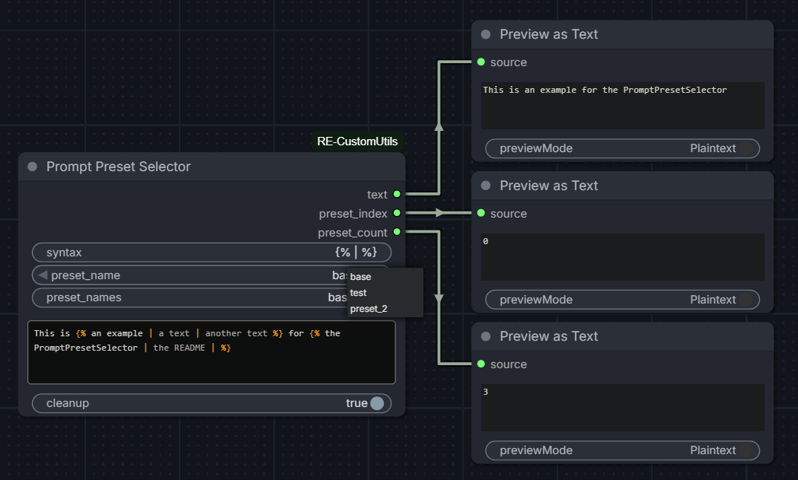
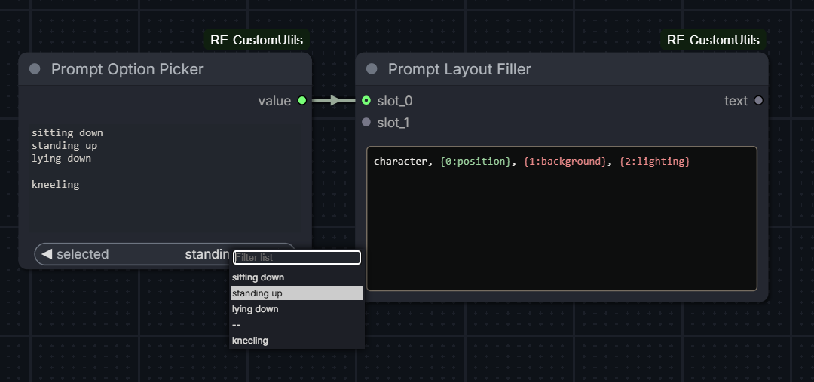

# ComfyUI - RE-CustomUtils

A collection of custom nodes for ComfyUI.

> [!NOTE]
> This project was inspired by the [cookiecutter](https://github.com/Comfy-Org/cookiecutter-comfy-extension) template, though the full architecture is a bit different.

## Quickstart

1. Install [ComfyUI](https://docs.comfy.org/get_started).
2. Install [ComfyUI-Manager](https://github.com/ltdrdata/ComfyUI-Manager)
3. Look up this extension in ComfyUI-Manager. If you are installing manually, clone this repository under `ComfyUI/custom_nodes`.
4. Restart ComfyUI.

---

## Nodes

### PromptPresetSelector



#### Inputs

- `syntax` (str), default to `` — defines the opening tag, separator, and closing tag as a single field, space-separated
- `preset_index` (int), 0-based, default to `0` — loops both ways within range
- `preset_name` (combo) — dynamic dropdown, active when `preset_names` is filled
- `preset_names` (str), optional — comma-separated list of preset names. Ex: `neutral, happy, sad`. If fewer names than presets, remaining are auto-named (`preset_2`, `preset_3`...). If more, extra names are ignored.
- `text` (str), multiline textarea supporting preset blocks
- `cleanup` (bool), default to `True`

#### Outputs

- `text` (str) — the formatted text, with preset blocks resolved
- `preset_index` (int) — the selected index
- `preset_count` (int) — the number of presets found across blocks

#### Usage

Include preset blocks in your `text` using the syntax defined in the `syntax` field. Each block holds options separated by the separator. Depending on `preset_index`, the matching option is injected and the block markers are removed.

```
This is  for 
```

- `preset_index` = `0` → `This is an example for the PromptPresetSelector`
- `preset_index` = `1` → `This is a text for the README`
- `preset_index` = `2` → `This is another text for`

Empty presets are allowed — the block is simply replaced by an empty string.

#### Custom syntax

The `syntax` field allows changing the opening tag, separator and closing tag. Format is always `open_tag separator close_tag`, space-separated.

```
<< / >>
```

Would match blocks like `<< option_a / option_b >>`.

#### Preset names

When `preset_names` is filled, `preset_index` is replaced by a dynamic dropdown (`preset_name`) built from the comma-separated names. The dropdown resets to the first preset when activated.

If fewer names than presets are defined, remaining entries are auto-named (`preset_2`, `preset_3`...). If more names than presets, extra names are ignored.

#### Preset references

Inside a preset, you can reference a previously declared preset using `$N` (0-based index).

```

```

- `preset_index` = `0` → `base style`
- `preset_index` = `1` → `base style, hat`
- `preset_index` = `2` → `base style, hat, jewelry`

References are resolved recursively — `$1` in preset 2 resolves preset 1, which may itself reference preset 0.

Rules:
- `$N` can only reference a preset with a lower index (forward references are not allowed)
- `$N` must be within range
- Circular references raise an error

#### Cleanup

When `cleanup` is enabled, the following are removed from the output:

- Spaces before commas
- Double or empty commas
- Empty lines

#### Validation

The node runs the following checks and stops the workflow on error:

- `syntax` must contain exactly 3 space-separated parts
- `open_tag` and `close_tag` must be different
- All preset blocks in `text` must have the same number of options
- `preset_index` must be within range

---

### PromptOptionPicker



#### Inputs

- `options` (str) — one option per line. Empty lines are allowed and displayed
  as `--` in the dropdown, with an empty string as value.
- `selected` (combo) — dynamic dropdown built from the `options` field.

#### Outputs

- `value` (str) — the selected option, or `""` if `--` is selected.

#### Usage

Fill the `options` field with one option per line. The dropdown updates
automatically as you type.

```
sitting down
standing up
lying down

kneeling
```

The empty line above produces a `--` entry in the dropdown, which outputs
an empty string. If the field is empty, the dropdown resets to `--`.

---

### PromptLayoutFiller


#### Inputs

- `template` (str) — multiline text with placeholders. Supports `{N}` or
  `{N:label}` syntax where `N` is the slot index (0-based) and `label` is
  a purely visual annotation.
- `slot_0` to `slot_9` (str, connectable) — values injected into the
  corresponding placeholders. Slots are revealed one by one as the previous
  one is connected. Up to 10 slots supported.

#### Outputs

- `text` (str) — the template with all placeholders resolved.

#### Usage

Write a template in the `text` field using placeholders:

```
character, {0:position}, {1:background}, {2:lighting}
```

Connect a node (e.g. a `PromptOptionPicker`) to each slot. The placeholder
is replaced by the connected value at execution.

#### Validation

The node stops the workflow on error if:
- The template is empty
- A placeholder index exceeds the maximum slot index (9)
- A placeholder is used but the corresponding slot is not connected

#### Typical workflow

```
[PromptOptionPicker] → slot_0 ┐
[PromptOptionPicker] → slot_1 ├→ [PromptLayoutFiller] → text
[PromptOptionPicker] → slot_2 ┘
```

Each `PromptOptionPicker` manages its own list of options independently.
Slot lengths do not need to match.

---

### Web

#### contentEditable editor

Some text widgets are replaced by a `contentEditable` div that provides syntax highlighting.
Supported widgets and nodes:
- `text` widget in `PromptPresetSelector`
- `template` widget in `PromptLayoutFiller`

Colors update in real time while editing or changing other widget's values and pasting always inserts plain text, stripping any HTML formatting.

`PromptPresetSelector`:
- **Orange**: tags and separators
- **Gray**: inactive presets
- **Blue**: `$N` references on the active preset

`PromptLayoutFiller`:

Placeholders are highlighted in the editor:
- **Green**: slot is connected
- **Red**: slot is referenced but not connected

#### Keyboard shortcuts

| Shortcut    | Action                                                                                                     |
| ----------- | ---------------------------------------------------------------------------------------------------------- |
| `Ctrl+Up`   | Increase weight of selected text or word under caret by `0.1`. Ex: `tag` → `(tag:1.1)`                     |
| `Ctrl+Down` | Decrease weight of selected text or word under caret by `0.1`. Ex: `(tag:1.1)` → `tag` when reaching `1.0` |

The selection is preserved after each keypress, consistent with ComfyUI native behavior.

---

## TODO

`PromptPresetSelector`
- Add a field to easily concatenate text at the end of the output
- Wildcard mode for presets (randomly selected, index to -1 or -2?)