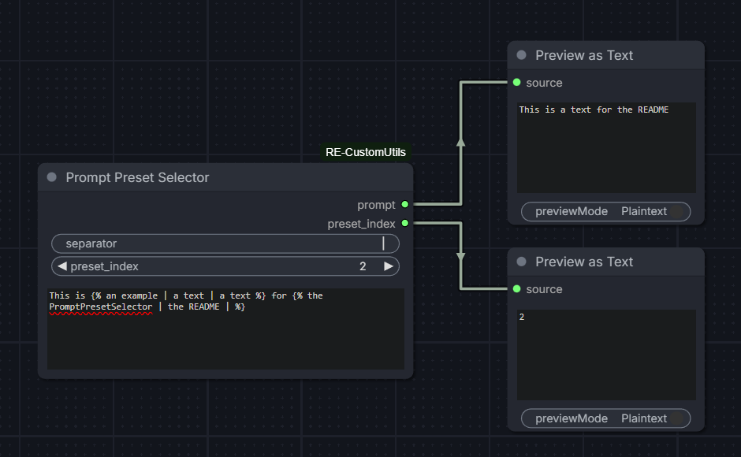

# ComfyUI - RE-CustomUtils

A collection of custom nodes for ComfyUI.

> [!NOTE]
> This project was inspired by the [cookiecutter](https://github.com/Comfy-Org/cookiecutter-comfy-extension) template, though the full architecture is a bit different.


## Quickstart

1. Install [ComfyUI](https://docs.comfy.org/get_started).
2. Install [ComfyUI-Manager](https://github.com/ltdrdata/ComfyUI-Manager)
3. Look up this extension in ComfyUI-Manager. If you are installing manually, clone this repository under `ComfyUI/custom_nodes`.
4. Restart ComfyUI.


## Features

### PromptPresetSelector node



Input:
- `separator` (str), default to |
- `preset_index` (int) in range 1 to 50, default to 1
- `text` (str), a multiline textarea
- `cleanup` (bool), default to **True**

Output:
- `prompt` (str), the formatted prompt
- `preset_index` (int), the selected index

This node helps introducing variations to a text, usually a prompt, by supporting templates. Basically, you can include a template like this `` in your `text`, that will hold various options, separated by the `separator`.

Depending on the chosen `preset_index`, the correct preset option will be parsed and add to the text.

> Example:
> 
```
This is  for 
```

- With `preset_index` == 1: This is an example for the PromptPresetSelector
- With `preset_index` == 2: This is an text for the README
- With `preset_index` == 3: This is an text for

The node validates that the `separator` is filled, that you registered the same amount of options in all of the templates, and that you selected a `preset_index` within the length of the configured presets.

> Example:

If we fix `preset_index` to 3:

- *This is **** for ***** => Error, first template with 2 presets while the second only got 1
- *This is **** for ***** => Error, only 2 presets were configured

A `cleanup` option is also provided, to clean spaces before comas, double or empty comas and empty lines, that may result from the preset application.


### Web folder

#### PromptColorEditor

This extension adds a `contentEditable` div on top of the `text` textarea of the **PromptPresetSelector** to display the tags with some color. The colors will be displayed when the textarea loses focus, and will disappear when focused.

Currently, tags and separators will have the same color, and the unselected presets will be grayed out. The colors are also updated live when the `selector` or `preset_index` values are changed


## TODO

- Add JS to transform the preset_index in a dynamic dropdown, based on the configured presets
- Add field to name the different presets
- Add field to easily concatenate text at the end of the prompt
