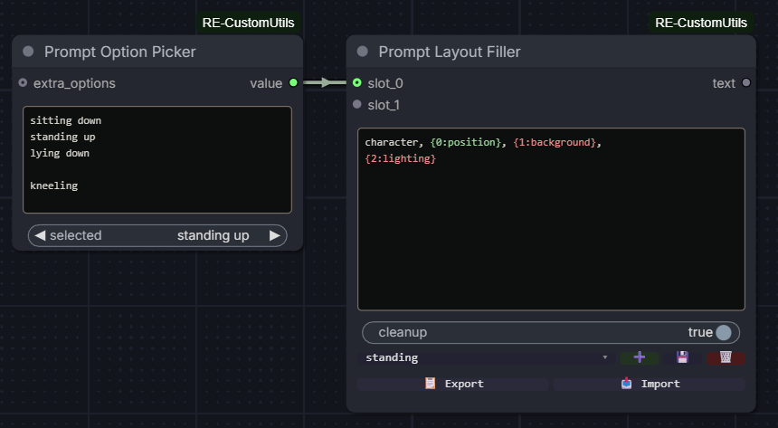
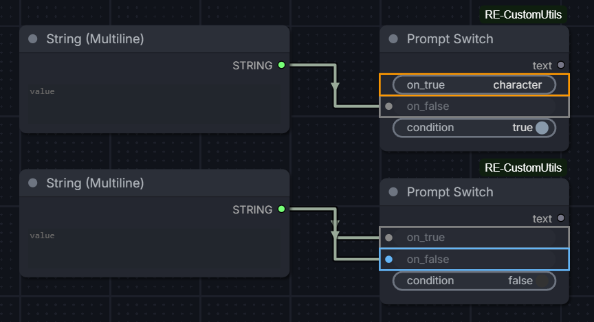
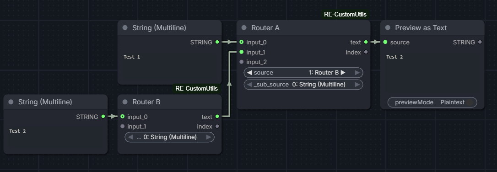
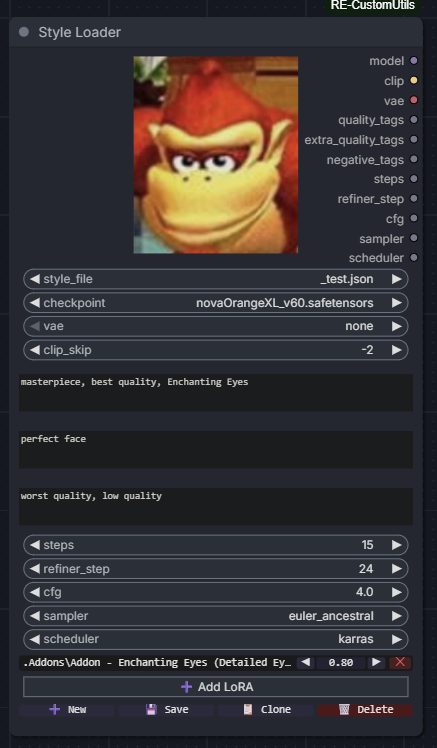
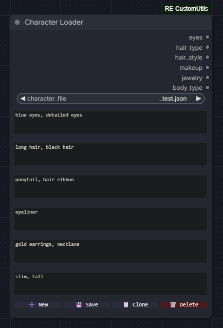
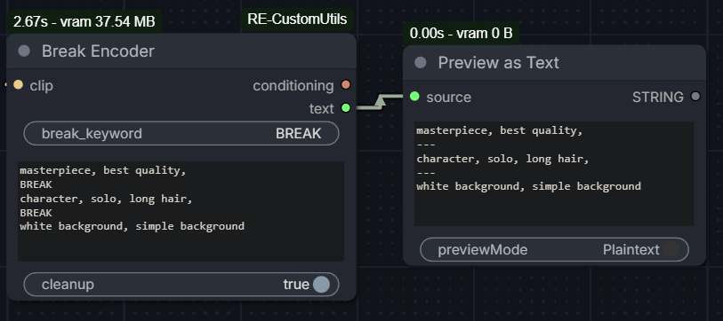

# ComfyUI - RE-CustomUtils

A collection of custom nodes for ComfyUI.

> [!NOTE]
> This project was inspired by the [cookiecutter](https://github.com/Comfy-Org/cookiecutter-comfy-extension) template, though the full architecture is a bit different.

## Quickstart

1. Install [ComfyUI](https://docs.comfy.org/get_started).
2. Install [ComfyUI-Manager](https://github.com/ltdrdata/ComfyUI-Manager)
3. Look up this extension in ComfyUI-Manager. If you are installing manually, clone this repository under `ComfyUI/custom_nodes`.
4. Restart ComfyUI.

---

## Nodes

### PromptPresetSelector


#### Inputs

- `syntax` (str), default to `` — defines the opening tag, separator, and closing tag as a single field, space-separated
- `preset_index` (int), 0-based, default to `0` — loops both ways within range
- `preset_name` (combo) — dynamic dropdown, active when `preset_names` is filled
- `preset_names` (str), optional — comma-separated list of preset names. Ex: `neutral, happy, sad`. If fewer names than presets, remaining are auto-named (`preset_2`, `preset_3`...). If more, extra names are ignored.
- `text` (str), multiline textarea supporting preset blocks
- `cleanup` (bool), default to `True`

#### Outputs

- `text` (str) — the formatted text, with preset blocks resolved
- `preset_index` (int) — the selected index
- `preset_count` (int) — the number of presets found across blocks

#### Usage

Include preset blocks in your `text` using the syntax defined in the `syntax` field. Each block holds options separated by the separator. Depending on `preset_index`, the matching option is injected and the block markers are removed.

```
This is  for 
```

- `preset_index` = `0` → `This is an example for the PromptPresetSelector`
- `preset_index` = `1` → `This is a text for the README`
- `preset_index` = `2` → `This is another text for`

Empty presets are allowed — the block is simply replaced by an empty string.

#### Custom syntax

The `syntax` field allows changing the opening tag, separator and closing tag. Format is always `open_tag separator close_tag`, space-separated.

```
<< / >>
```

Would match blocks like `<< option_a / option_b >>`.

#### Preset names

When `preset_names` is filled, `preset_index` is replaced by a dynamic dropdown (`preset_name`) built from the comma-separated names. The dropdown resets to the first preset when activated.

If fewer names than presets are defined, remaining entries are auto-named (`preset_2`, `preset_3`...). If more names than presets, extra names are ignored.

#### Preset references

Inside a preset, you can reference a previously declared preset using `$N` (0-based index).

```

```

- `preset_index` = `0` → `base style`
- `preset_index` = `1` → `base style, hat`
- `preset_index` = `2` → `base style, hat, jewelry`

References are resolved recursively — `$1` in preset 2 resolves preset 1, which may itself reference preset 0.

Rules:
- `$N` can only reference a preset with a lower index (forward references are not allowed)
- `$N` must be within range
- Circular references raise an error

#### Cleanup

When `cleanup` is enabled, the following are removed from the output:

- Spaces before commas
- Multiple consecutive spaces
- Empty or comma-only parentheses and brackets
- Residual commas after opening or before closing parentheses
- Double or empty commas
- Leading commas
- Empty lines

#### Validation

The node runs the following checks and stops the workflow on error:

- `syntax` must contain exactly 3 space-separated parts
- `open_tag` and `close_tag` must be different
- All preset blocks in `text` must have the same number of options
- `preset_index` must be within range

---

### PromptOptionPicker


#### Inputs

- `options` (str) — one option per line. Empty lines are allowed and displayed
  as `--` in the dropdown, with an empty string as value.
- `selected` (combo) — dynamic dropdown built from the `options` field.

#### Outputs

- `value` (str) — the selected option, or `""` if `--` is selected.

#### Usage

Fill the `options` field with one option per line. The dropdown updates
automatically as you type.

```
sitting down
standing up
lying down

kneeling
```

The empty line above produces a `--` entry in the dropdown, which outputs
an empty string. If the field is empty, the dropdown resets to `--`.

#### Labels

Options can be labeled using the `label $: value` syntax. The label is shown in the dropdown, but the real value is transmitted on output:

```
neutral $: character, simple background
happy $: character, smile, laughing
sad $: character, crying
```

For unlabeled options, use `$: value` — the option is auto-named `option_N`:

```
$: character, simple background
$: character, smile
```

#### Cartesian product blocks

Use `@combine / --- / @end` blocks to generate all combinations of multiple lists:

```
@combine
from front
straight-on
from side
---
from above
from below
---
close-up
full body
@end
```

Each `---` separates a new list. The block expands into all combinations joined by `, `:

```
from front, from above, close-up
from front, from above, full body
from front, from below, close-up
...
```

Multiple `@combine` blocks are allowed and processed independently. A `---` outside a block is treated as a literal option.

#### Validation

The node stops the workflow on error if:
- A `@combine` block is opened inside another
- A `@end` is found without a matching `@combine`
- A `@combine` block is never closed

---

### PromptLayoutFiller



#### Inputs

- `template` (str) — multiline text with placeholders. Supports `{N}` or
  `{N:label}` syntax where `N` is the slot index (0-based) and `label` is
  a purely visual annotation.
- `cleanup` (bool), default `True`
- `slot_0` to `slot_9` (str, connectable) — values injected into the
  corresponding placeholders. Slots are revealed one by one as the previous
  one is connected. Up to 10 slots supported.

#### Outputs

- `text` (str) — the template with all placeholders resolved.

#### Usage

Write a template in the `text` field using placeholders:

```
character, {0:position}, {1:background}, {2:lighting}
```

Connect a node (e.g. a `PromptOptionPicker`) to each slot. The placeholder
is replaced by the connected value at execution.

#### Presets

The node supports saving and recalling slot configurations as named presets, stored directly in the workflow.

```
[preset dropdown] [➕] [💾] [🗑️]
[📋 Export]  [📥 Import]
```

| Button     | Action                                                             |
| ---------- | ------------------------------------------------------------------ |
| `➕`        | Creates a new preset from current slot values (prompts for a name) |
| `💾`        | Overwrites the selected preset with current slot values            |
| `🗑️`        | Deletes the selected preset and recalls the next one if available  |
| `📋 Export` | Copies all presets as JSON to clipboard                            |
| `📥 Import` | Pastes and loads presets from JSON                                 |

Presets are sorted alphabetically. Recalling a preset pushes the saved values into connected source nodes. If a saved value is no longer available in a source node, or the source node is disconnected, an error is raised.

#### Cleanup

Same rules as `PromptPresetSelector`. Useful when a connected slot outputs an empty string, leaving residual commas or parentheses.

#### Validation

The node stops the workflow on error if:
- The template is empty
- A placeholder index exceeds the maximum slot index (9)
- A placeholder is used but the corresponding slot is not connected

#### Typical workflow

```
[PromptOptionPicker] → slot_0 ┐
[PromptOptionPicker] → slot_1 ├→ [PromptLayoutFiller] → text
[PromptOptionPicker] → slot_2 ┘
```

Each `PromptOptionPicker` manages its own list of options independently.
Slot lengths do not need to match.

---

### PromptSwitch



#### Inputs

- `on_true` (str) — value returned when condition is `True`. Accepts direct input or connected node.
- `on_false` (str) — value returned when condition is `False`. Accepts direct input or connected node.
- `condition` (bool), default `True` — controls which input is routed to the output.

#### Outputs

- `text` (str) — the selected value based on condition.

#### Usage

Connect or type a value in `on_true` and `on_false`. Toggle `condition` to switch between them.

If the node is bypassed, an empty string is returned.

#### Editor

Input ports and widget borders are colored based on the active condition:
- **Orange**: active input when condition is `True`
- **Blue**: active input when condition is `False`
- **Gray**: inactive input
Colors are only shown when an input is connected or has a value.

---

### PromptRouter



#### Inputs

- `selected` (str, internal) — stores the active selection for workflow persistence.
- `_sub_selected` (str, internal) — stores the active sub-router selection.
- `input_0` to `input_9` (str, connectable) — values to route. Slots are revealed one by one as the previous one is connected. Up to 10 slots supported.

#### Outputs

- `text` (str) — value of the selected input.
- `index` (int) — index of the selected input.

#### Usage

Connect nodes to the input slots. The dropdown automatically populates with the title of each connected source node, prefixed by its index:

```
0: position
1: background
2: lighting
```

Select the active input from the dropdown. The node outputs the value of the selected input.

If a connected node is bypassed, the output is an empty string.

#### Sub-router

If a connected source node is itself a `PromptRouter`, it is marked with a `▶` indicator in the dropdown:

```
0: position
1: Router B ▶
2: background
```

Selecting it reveals a second dropdown populated with the options of the child router. The parent outputs the value selected in the child dropdown.

Changing the selection in either the parent sub-dropdown or the child router updates both in sync. Multiple parents connected to the same child router all stay synchronized.

Sub-routing is limited to one level deep.

#### Special node integration

When a connected source node is a `PromptOptionPicker`, `PromptLayoutFiller`, or `PromptPresetSelector`, it is marked with a `◆` indicator in the dropdown:

```
0: position ◆
1: Router B ▶
2: background
```

Selecting it reveals a third dropdown populated with the options or presets of that node. The selection is synchronized in both directions: changing the value in the Router updates the source node, and changing it in the source node updates the Router.

This also works one level deep through a sub-router:
```
[Router] → [sub-router ▶] → [OptionPicker ◆] → [value dropdown]
```

#### Editor

- The dropdown updates automatically when source nodes are connected, disconnected, or renamed.
- The active selection is preserved across workflow saves, reloads, and undo/redo.

#### Known limitations

- If a child router's connections change while it is selected in the parent, the parent dropdown may not update immediately. Reconnecting or modifying the parent will trigger a refresh.
- If a getter node is connected to the router, the getter's name will be in the router's dropdown but, the getter being "invisible" (directly getting the setter's value), the value would be provided by the node before the setter. Thus, the router would receive an empty string, because of not getting the right node. Linking the getter with a string node before connecting to the router solves the issue.

---

### QuickCombo

#### Inputs

- `options` (str) — comma-separated list of options typed inline. Ex: `neutral, happy, sad`
- `selected` (combo) — dynamic dropdown built from the `options` field
- `one_based` (bool), default `False` — if `True`, the index output starts at `1` instead of `0`

#### Outputs

- `value` (str) — selected option
- `index` (int) — index of the selected option (0-based by default)

#### Usage

Type a comma-separated list in the `options` field. The dropdown updates automatically as you type.

```
neutral, happy, sad, angry
```

Toggle `one_based` to match the indexing convention of other nodes in your workflow.

#### Differences from PromptOptionPicker

|                   | QuickCombo             | PromptOptionPicker      |
| ----------------- | ---------------------- | ----------------------- |
| Input format      | Inline comma-separated | Multiline, one per line |
| `@combine` blocks | No                     | Yes                     |
| Labels (`$:`)     | No                     | Yes                     |
| Empty options     | No                     | Yes (`--`)              |
| Use case          | Quick setup            | Advanced lists          |

---

### StyleLoader



#### Inputs

- `style_file` (combo) — dropdown listing all `.json` files found recursively under the `styles/` folder. Supports subfolders (e.g. `anime/illustrious.json`).
- `checkpoint` (combo) — model checkpoint to load.
- `vae` (combo) — VAE override. Select `none` to use the checkpoint's built-in VAE.
- `clip_skip` (int), default `-2` — number of CLIP layers to skip. Set to `-1` to disable.
- `quality_tags` (str) — positive quality prompt, passed through as a string output.
- `extra_quality_tags` (str) — extra positive quality prompt, passed through as a string output.
- `negative_tags` (str) — negative quality prompt, passed through as a string output.
- `steps` (int), default `15` — number of sampling steps.
- `refiner_step` (int), default `24` — step at which a refiner pass begins, if used.
- `cfg` (float), default `4.0` — classifier-free guidance scale.
- `sampler` (combo) — sampler name, sourced from ComfyUI's own sampler list.
- `scheduler` (combo) — scheduler name, sourced from ComfyUI's own scheduler list.
- `loras_data` (str, internal) — serialized LoRA list for workflow persistence.

#### Outputs

- `model` — loaded model with LoRAs applied.
- `clip` — CLIP encoder with clip skip and LoRAs applied.
- `vae` — VAE (overridden or from checkpoint).
- `quality_tags` (str) — positive prompt passthrough.
- `extra_quality_tags` (str) — extra positive prompt passthrough.
- `negative_tags` (str) — negative prompt passthrough.
- `steps` (int)
- `refiner_step` (int)
- `cfg` (float)
- `sampler` (str)
- `scheduler` (str)

#### Usage

Style files are `.json` files stored under the `src/data/styles/` folder at the root of the extension. Subfolders are supported and reflected in the dropdown after a page refresh.

A style file contains all parameters for a generation setup:

```json
{
  "checkpoint": "model.safetensors",
  "vae": "none",
  "clip_skip": -2,
  "loras": [
    { "name": "lora.safetensors", "weight": 0.8 }
  ],
  "quality_tags": "masterpiece, best quality",
  "extra_quality_tags": "perfect face",
  "negative_tags": "worst quality, low quality",
  "steps": 15,
  "refiner_step": 24,
  "cfg": 4.0,
  "sampler": "euler_ancestral",
  "scheduler": "karras"
}
```

LoRAs support a single `weight` (applied to both model and clip), or separate `model_weight` and `clip_weight`.

#### Preview

You can embed a preview image for each of your styles by putting an image with the same name as the style in its directory. The node looks for `png`, `jpg`, `webp` or `jpeg` files, and display the image if found on top of the style_file input, next to the outputs.

#### Editor

The node includes a built-in styled editor:

- All fields are native ComfyUI widgets — checkpoints, VAE and samplers have built-in search and autocomplete.
- LoRA rows are displayed as canvas widgets, one per line, with a name picker, weight control, and remove button.
- The weight can be adjusted by dragging horizontally, clicking the `◀` / `▶` arrows, or clicking the value to type it directly.
- Clicking the LoRA name opens a searchable dropdown.

#### Actions

| Button     | Action                                                  |
| ---------- | ------------------------------------------------------- |
| `➕ New`    | Creates a new style file from a blank template          |
| `💾 Save`   | Saves current widget values to the selected style file  |
| `📋 Clone`  | Saves current values to a new file                      |
| `🗑️ Delete` | Deletes the selected style file (requires confirmation) |

Adding a new style file or refreshing an existing one takes effect immediately without restarting ComfyUI. Adding new files to the `styles/` folder externally requires a page refresh (F5) to appear in the dropdown.

---

### CharacterLoader



#### Inputs

- `character_file` (combo) — dropdown listing all `.json` files found recursively under the `src/data/characters/` folder.
- `eyes` (str) — eye description tags.
- `hair_type` (str) — hair type tags.
- `hair_style` (str) — hair style tags.
- `makeup` (str) — makeup tags.
- `jewelry` (str) — jewelry tags.
- `body_type` (str) — body type tags.

#### Outputs

- `eyes` (str)
- `hair_type` (str)
- `hair_style` (str)
- `makeup` (str)
- `jewelry` (str)
- `body_type` (str)

#### Usage

Same file system as `StyleLoader`, JSON files stored under `src/data/characters/`. Subfolders are supported and reflected in the dropdown after a page refresh.

```json
{
  "eyes": "blue eyes, detailed eyes",
  "hair_type": "long hair, black hair",
  "hair_style": "ponytail, hair ribbon",
  "makeup": "eyeliner",
  "jewelry": "gold earrings, necklace",
  "body_type": "slim, tall"
}
```

Each field is output as a plain string, ready to be plugged into any other string input.

#### Actions

| Button     | Action                                                      |
| ---------- | ----------------------------------------------------------- |
| `➕ New`    | Creates a new character file from a blank template          |
| `💾 Save`   | Saves current field values to the selected character file   |
| `📋 Clone`  | Saves current values to a new file                          |
| `🗑️ Delete` | Deletes the selected character file (requires confirmation) |

---

### BreakEncoder



#### Inputs

- `clip` (CLIP) — CLIP encoder, typically from a checkpoint loader.
- `break_keyword` (str), default `BREAK` — keyword used to split the prompt into blocks. Case-sensitive.
- `text` (str) — multiline prompt with break blocks.
- `cleanup` (bool), default `True` — applies prompt cleanup on each block before encoding.

#### Outputs

- `conditioning` (CONDITIONING) — concatenated conditioning from all blocks.
- `text` (str) — cleaned blocks joined by `\n---\n`, reflecting exactly what was encoded.

#### Usage

Write a prompt with break blocks separated by the keyword:

```
masterpiece, best quality,
BREAK
character, solo, long hair,
BREAK
white background, simple background
```

Each block is encoded separately then concatenated, equivalent to ComfyUI's `ConditioningConcat` chained across all blocks. This matches the behavior of A1111/Yodayo's `BREAK` keyword.

The `text` output reflects exactly what was encoded after cleanup, useful for debugging:

```
masterpiece, best quality
---
character, solo, long hair
---
white background, simple background
```

#### Cleanup

When enabled, applies the same cleanup rules as `PromptPresetSelector` on each block individually. Blocks that become empty after cleanup are silently filtered out.

#### Validation

The node stops the workflow on error if:
- `clip` input is `None`
- `text` is empty or whitespace only
- `break_keyword` is empty or whitespace only
- No valid blocks remain after splitting and cleanup

---

### Web

#### contentEditable editor

Some text widgets are replaced by a `contentEditable` div that provides syntax highlighting.
Supported widgets and nodes:
- `text` widget in `PromptPresetSelector`
- `options` widget in `PromptOptionPicker`
- `template` widget in `PromptLayoutFiller`

Colors update in real time while editing or changing other widget's values and pasting always inserts plain text, stripping any HTML formatting.

`PromptPresetSelector`:
- **Orange**: tags and separators
- **Gray**: inactive presets
- **Blue**: `$N` references on the active preset

`PromptOptionPicker`:
- **Orange**: `@combine / --- / @end` tags
- **Cyan**: labels
- **Gray**: `$:` separators

`PromptLayoutFiller`:

Placeholders are highlighted in the editor:
- **Green**: slot is connected
- **Red**: slot is referenced but not connected

#### Keyboard shortcuts

| Shortcut    | Action                                                                                                     |
| ----------- | ---------------------------------------------------------------------------------------------------------- |
| `Ctrl+Up`   | Increase weight of selected text or word under caret by `0.1`. Ex: `tag` → `(tag:1.1)`                     |
| `Ctrl+Down` | Decrease weight of selected text or word under caret by `0.1`. Ex: `(tag:1.1)` → `tag` when reaching `1.0` |

The selection is preserved after each keypress, consistent with ComfyUI native behavior.

---

## Tests

This project uses `pytest` and `pytest-aiohtttp` for its tests, and [uv](https://github.com/astral-sh/uv) for the versioning.
After downloading `uv`, just run:
```sh
uv sync --dev
.venv\Scripts\activate.bat    # Windows
source .venv/bin/activate     # Linux/MacOS
```
and you should have the dependencies ready.

Then, to run the tests:
```sh
uv run pytest
```

### Limitations

Currently, the relative imports in the root `__init__.py` file are preventing pytest from running. The solution is to change all the imports from `.src.xxx` to `src.xxx` for the tests, and then revert them for the ComfyUI execution.

---

## TODO

`PromptPresetSelector`
- Add a field to easily concatenate text at the end of the output
- Wildcard mode for presets (randomly selected, index to -1 or -2?)
- Original `preset_names` unchanged if changed from a `PromptRouter` (even though the value is still the correct one)

`PromptRouter`
- Add support for more sub-routing levels?
- Support special node integration beyond one sub-router level?

`StyleLoader`
- LoRA toggle on/off per row
- Separate model/clip weight per LoRA on UI
- Better LoRA row style

`CharacterLoader`
- Preview image for characters

`BreakEncoder`
- Colored editor highlighting BREAK keywords
